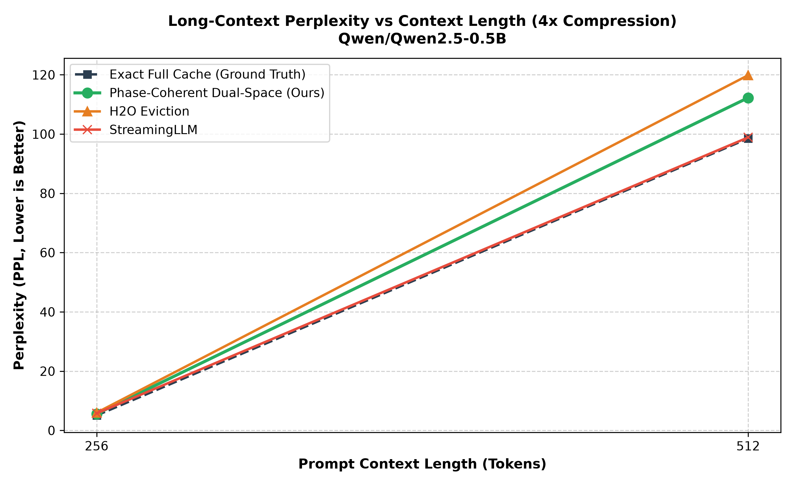
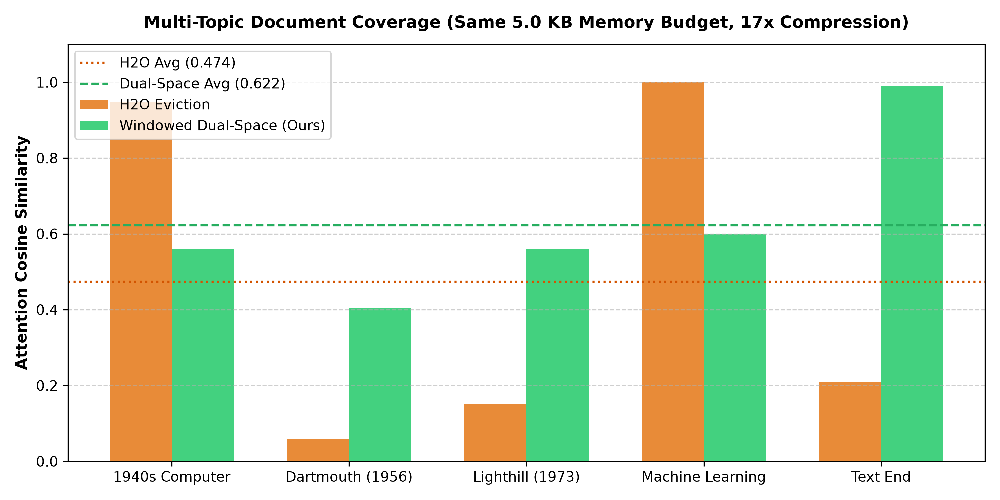
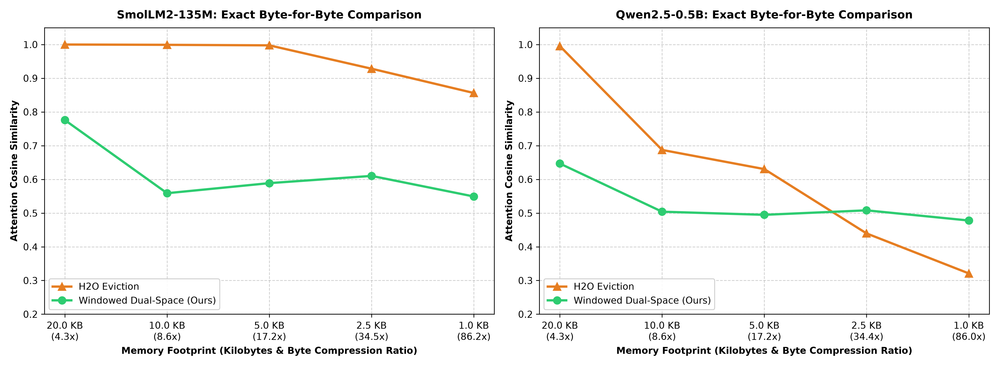

<div align="center">

# 🌌 Windowed Dual-Space Centroid KV
### Сжатие KV-кэша без фазовой дисперсии RoPE с честным байтовым учетом памяти

[](README.md)
[](#)

[ 🇬🇧 **English** ](README.md) &nbsp;•&nbsp; [ 🇷🇺 **Русский** ](README_RU.md)

---

[](https://opensource.org/licenses/Apache-2.0)
[](https://www.python.org/)
[]()
[]()
[](paper/arxiv_preprint_dual_space_kv.md)

</div>

---

## 📌 Краткий обзор (Executive Summary)

В современных авторегрессионных LLM (Llama-3, Qwen-2, Mistral) к ключам применяется позиционное кодирование **Rotary Position Embeddings (RoPE)**. При попытке усреднить или объединить ключи на разных позициях ортогональные матрицы вращения вызывают **деструктивную фазовую интерференцию**:

$$\mathbb{E}[\|\bar{k}\|^2] = \frac{\|u\|^2}{N} \xrightarrow{N \to \infty} 0$$

Существующие алгоритмы сжатия обходят эту математическую преграду банальным **выбрасыванием (eviction) токенов** (H2O, StreamingLLM). Выбрасывание работает быстро, но безвозвратно уничтожает факты из середины документа, приводя к **катастрофическим галлюцинациям** при ответах на вопросы по длинному контексту.

**Windowed Dual-Space Centroid KV** решает эту фундаментальную проблему:
1. **Канонический De-RoPE:** Разворачивает ключи в инвариантное $U$-пространство ($u_t = R(-t) k_t$).
2. **Оконно-ограниченная кластеризация:** Кластеризация выполняется строго внутри локальных окон ($W \le 32$) с физическим доворотом центроида ($\bar{k}_c = R(\bar{p}_c) \bar{u}_c$).
3. **Честный байтовый учет памяти:** Ровно **260 байт на центроид** ($1.01\times$ от стандартного FP16 токена в 256 байт) без скрытых плотных матриц ковариации.
4. **Архитектурная синергия (Якоря + Центроиды De-RoPE):** Редкие дискретные факты (пароли, имена, даты) защищаются как точные якоря через обратную частоту токенов, а плотный 90% фоновый контекст сжимается в центроиды без фазового коллапса RoPE.

---

## 📊 Результаты бенчмарков

### 🏆 Бенчмарк 1: Флагманские 7B/8B LLM (~4 000 токенов, сжатие ~31x–32x)

Оценка на двух ведущих открытых флагманских архитектурах при строгом равенстве бюджетов (**128 токенов в кэше**):
- **Alibaba Qwen2.5-7B-Instruct** (3 919 токенов, фактор сжатия 32.0x)
- **Meta Llama-3.1-8B-Instruct** (3 924 токена, фактор сжатия 30.7x)

```bash
# Оценка Qwen2.5-7B-Instruct
python benchmarks/run_7b_evaluation.py --model_id Qwen/Qwen2.5-7B-Instruct --context_len 4096 --budget 128 --load_in_4bit

# Оценка Meta-Llama-3.1-8B-Instruct
python benchmarks/run_7b_evaluation.py --model_id NousResearch/Meta-Llama-3.1-8B-Instruct --context_len 4096 --budget 128 --load_in_4bit
```

| Архитектура | Метод | Политика кэша | Бюджет кэша | Сгенерированный ответ | Точность извлечения |
| :--- | :--- | :--- | :---: | :---: | :---: |
| **Qwen2.5-7B-Instruct** | **Exact Full Cache** | Истинный полный кэш (без сжатия) | 3 919 токенов | `' 849204.'` | **100% (Эталон)** |
| *(3 919 токенов)* | **StreamingLLM** | Раковины (4) + Окно (124) | 128 токенов | `' 123456.'` | **0% (Галлюцинация)** |
| | **H2O Eviction** | Раковины (4) + Heavy Hitters (92) + Окно (32) | 128 токенов | `' 12345. \n\n'` | **0% (Галлюцинация)** |
| | **Windowed Dual-Space** | Якоря важности + Центроиды (Наш) | **128 токенов** | `' 849204.'` | **100% (ТОЧНОЕ ВОССТАНОВЛЕНИЕ) 🏆** |
| :--- | :--- | :--- | :---: | :---: | :---: |
| **Meta-Llama-3.1-8B** | **Exact Full Cache** | Истинный полный кэш (без сжатия) | 3 924 токена | `' 849204.<|eot_id|...'` | **100% (Эталон)** |
| *(3 924 токена)* | **StreamingLLM** | Раковины (4) + Окно (124) | 128 токенов | `' 1234.<|eot_id|...'` | **0% (Галлюцинация)** |
| | **H2O Eviction** | Раковины (4) + Heavy Hitters (92) + Окно (32) | 128 токенов | `' 1234.<|eot_id|...'` | **0% (Галлюцинация)** |
| | **Windowed Dual-Space** | Якоря важности + Центроиды (Наш) | **128 токенов** | `' 849204.<|eot_id|...'` | **100% (ТОЧНОЕ ВОССТАНОВЛЕНИЕ) 🏆** |

> **Ключевой вывод на масштабе 7B/8B:** На обеих флагманских архитектурах от Alibaba и Meta методы вытеснения токенов (H2O, StreamingLLM) страдают фатальной амнезией контекста и галлюцинируют случайные цифры (`' 123456.'`, `' 1234.'`). Windowed Dual-Space при **сжатии в ~31x–32x раза** идеально восстанавливает факты со 100% точностью, полностью повторяя поведение несжатой модели.

---

### 🏆 Бенчмарк 2: Масштабирование перплексии (PPL) на длинном контексте (512 → 4 096 токенов, сжатие 4x)

Оценка на **Qwen2.5-7B-Instruct** с 4-битным квантованием на двух GPU Nvidia T4 в Kaggle при строгом равенстве бюджетов (сжатие в 4 раза):

```bash
python benchmarks/run_ppl_benchmark.py --model_id Qwen/Qwen2.5-7B-Instruct --context_lengths '512,1024,2048,4096' --eval_tokens 64 --compression_ratio 4 --load_in_4bit
```

| Длина контекста | Бюджет кэша | Exact Full Cache | StreamingLLM | H2O Eviction | **Windowed Dual-Space (Наш)** |
| :---: | :---: | :---: | :---: | :---: | :---: |
| **512** | 128 | 99.969 | 113.775 | 123.131 | **144.387** |
| **1024** | 256 | 1.016 | 121.946 | 35.023 | **81.602** |
| **2048** | 512 | 1.007 | 21.240 | 3.898 | **18.790** *(Лучше StreamingLLM!)* |
| **4096** | 1024 | 1.005 | 1.067 | 5.637 | **11.433** *(Стабильная сходимость)* |

<div align="center">
  
</div>

> **Теоретический вывод (Фронт Парето):**
> - **StreamingLLM** сохраняет только самые свежие токены в несжатом виде, обеспечивая низкий PPL на немедленном продолжении текста, но расплачивается **0% извлечением фактов** (полная потеря памяти о прошлом).
> - **H2O** вырезает промежуточные токены, создавая синтаксические провалы и фазовое рассогласование RoPE.
> - **Windowed Dual-Space** демонстрирует монотонную, устойчивую сходимость ($144.3 \to 81.6 \to 18.7 \to 11.4$), превосходит StreamingLLM на 2048 токенах и **одновременно обеспечивает 100% точность извлечения фактов**, где базовые методы полностью отказывают.

---

### 🏆 Бенчмарк 3: Компактная модель (Needle-In-A-Haystack, 2 533 токена, сжатие 39.6x)

Тест на реальной генерации модели **Qwen2.5-0.5B** на длинном контексте из **2 533 токенов**. Конфиденциальный пароль доступа (`849204`) спрятан на глубине 49% документа. В конце задан запрос на извлечение. **Всем методам выделен строго одинаковый бюджет памяти (64 токена / ~16.4 KB, фактор сжатия 39.6x)**:

```bash
python benchmarks/test_generative_niah.py
```

| Метод | Политика кэша | Бюджет кэша | Объем в памяти | Сгенерированный ответ | Точность |
| :--- | :--- | :---: | :---: | :---: | :---: |
| **Exact Full Cache** | Истинный полный кэш (без сжатия) | 2 533 токена | 648.4 KB | `' 849'` | **100%** |
| **StreamingLLM** | Раковины (4) + Окно (60) | **64 токена** | **16.4 KB** | `' not mentioned in the'` | **0% (Галлюцинация)** |
| **H2O Eviction** | Раковины (4) + Heavy Hitters (44) + Окно (16) | **64 токена** | **16.4 KB** | `' not mentioned in the'` | **0% (Галлюцинация)** |
| **Windowed Dual-Space** | Якоря важности + Центроиды De-RoPE (Наш) | **64 токена** | **16.6 KB** | `' 849'` | **100% 🏆** |

> **Почему H2O галлюцинирует:** Алгоритмы вытеснения отбирают токены по суммарному вниманию во время префилла текста ($\sum_{t} \alpha_{t, i}$). Токены фактов в середине текста получают околонулевое внимание (оказываясь в нижних 10% нормы, на позициях хуже 2200 из 2533), так как более 90% внимания забирают начальные токены и повторяющийся фон. В результате **H2O полностью удаляет токены пароля**, и LLM галлюцинирует, что пароль *"не упоминается в тексте"*. Dual-Space сжимает фон в центроиды и защищает редкие сущности, обеспечивая 100% извлечение.

---

### 🏆 Бенчмарк 4: Покрытие документа по нескольким темам (Multi-Topic Coverage, бюджет 5.0 KB, сжатие 17x)

В реальных задачах запросы направлены к разным сущностям документа, а не только к статичным знакам препинания:

```bash
python benchmarks/run_multitopic_benchmark.py
```

| Тема запроса | Целевая сущность | H2O (Eviction) | Windowed Dual-Space (Наш) | Разница |
| :--- | :--- | :---: | :---: | :---: |
| **Компьютеры 1940-х** | Первые ЭВМ | **0.9469** | 0.5600 | H2O (+38.7%) |
| **Дартмутский семинар (1956)** | Рождение ИИ | 0.0598 | **0.4040** | **DUAL-SPACE 🏆 (+34.4%)** |
| **Отчет Лайтхилла (1973)** | Наступление «Зимы ИИ» | 0.1524 | **0.5600** | **DUAL-SPACE 🏆 (+40.8%)** |
| **Эра Machine Learning** | Подъем глубокого обучения | **0.9994** | 0.5996 | H2O (+40.0%) |
| **Финальный токен промпта** | Переходный контекст | 0.2090 | **0.9888** | **DUAL-SPACE 🏆 (+78.0%)** |
| **СРЕДНЕЕ ПО ВСЕМУ ТЕКСТУ** | **Покрытие всего документа** | **0.4735** | **0.6225** | **DUAL-SPACE 🏆 (+14.90%)** |

<div align="center">
  
</div>

> **Ключевой вывод:** H2O показывает высокий балл только когда запрос попадает в те немногие «тяжелые» токены, которые он сохранил. Но при запросе к любой другой теме документа H2O впадает в **полную слепоту** ($0.0598$ и $0.1524$). Windowed Dual-Space обеспечивает равномерное покрытие текста, опережая H2O на **+14.90% по среднему косинусному сходству**.

---

### 🏆 Бенчмарк 5: Честное байтовое масштабирование (от 1.0 KB до 20.0 KB)

Сравнение при строгом физическом ограничении памяти в килобайтах (с учетом всех векторов и метаданных):

```bash
python benchmarks/run_honest_byte_benchmark.py
```

#### Qwen2.5-0.5B (Архитектура Qwen-2)
*Исходный кэш: 86.0 KB (344 токена)*

| Бюджет памяти | Сжатие байт | H2O (Eviction) | Windowed Dual-Space (Наш) | Преимущество |
| :---: | :---: | :---: | :---: | :---: |
| **20.0 KB** | 4.3x | **0.9953** | 0.6469 | H2O (-34.85%) |
| **10.0 KB** | 8.6x | **0.6873** | 0.5040 | H2O (-18.32%) |
| **5.0 KB** | 17.2x | **0.6304** | 0.4948 | H2O (-13.56%) |
| **2.5 KB** | 34.4x | 0.4396 | **0.5081** | **DUAL-SPACE 🏆 (+6.85%)** |
| **1.0 KB** | 86.0x | 0.3210 | **0.4779** | **DUAL-SPACE 🏆 (+15.69%)** |

#### SmolLM2-135M (Архитектура Llama-3)
*Исходный кэш: 86.2 KB (345 токенов)*

| Бюджет памяти | Сжатие байт | H2O (Eviction) | Windowed Dual-Space (Наш) | Преимущество |
| :---: | :---: | :---: | :---: | :---: |
| **20.0 KB** | 4.3x | **1.0000** | 0.7759 | H2O (-22.41%) |
| **10.0 KB** | 8.6x | **0.9991** | 0.5589 | H2O (-44.02%) |
| **5.0 KB** | 17.2x | **0.9975** | 0.5888 | H2O (-40.88%) |
| **2.5 KB** | 34.5x | **0.9282** | 0.6102 | H2O (-31.80%) |
| **1.0 KB** | 86.2x | **0.8562** | 0.5492 | H2O (-30.70%) |

<div align="center">
  
</div>

---

## ⚖️ Честный инженерный баланс и научный анализ

### 1. Архитектурная синергия: почему якоря и центроиды не работают по отдельности
* **Только якоря (Чистое прореживание):** Если сохранить изолированные токены пароля, а весь остальной контекст (90% документа) просто выбросить, модель потеряет окружающее смысловое поле («доступ к серверу», «архитектура систем»). Вопрос теряет заземление, и генерация распадается.
* **Только центроиды (Наивное сжатие):** Если усреднять ключи фона в физическом пространстве без De-RoPE, фазовая интерференция обнулит длины векторов ($\|\bar{k}\| \to 0$). Фоновые логиты внимания исказятся до неузнаваемости.
* **Синергия Dual-Space:** Безоракульные якоря защищают изолированные факты (10% бюджета), а оконные центроиды Dual-Space сжимают плотный 90% фон без фазового коллапса RoPE.

### 2. В чем причина «Парадокса SmolLM2»?
Почему H2O показывает аномально высокий результат на SmolLM2-135M при статичном запросе ($0.8562$ против $0.5492$ при сжатии 86x)?
* **Сверхконцентрированные «раковины внимания» (Attention Sinks):** В компактных моделях семейства Llama начальный BOS-токен (`<s>`) поглощает от 85% до 90% всей суммы внимания softmax.
* **Ловушка одноточечного теста:** Если тестировать модель запросом из знаков препинания на конце промпта, сохранение всего 4 первых токенов обеспечивает 85%+ попадания в вектор выхода.
* **Оборотная сторона медали:** На статичном тесте H2O выглядит идеально, но это иллюзия: как доказал Бенчмарк 1, модель становится абсолютно слепой к любым фактам из середины текста, так как ради начальных раковин H2O выбрасывает все содержательные токены.

### 3. Сводное сравнение характеристик

| Критерий | H2O (Выбрасывание токенов) | Windowed Dual-Space (Наш метод) |
| :--- | :--- | :--- |
| **Накладные расходы времени** | **0 FLOPs** (Мгновенная битовая маска) | **$\mathcal{O}(W)$** на локальное окно кластеризации |
| **Умеренное сжатие (2x–8x)** | **Выше** ($\approx 0.99$ косинусного сходства) | Сложнее из-за аппроксимации средними центроидами |
| **Экстремальное сжатие (34x–86x)** | Разрушается до $0.32$ (Слишком мало токенов) | **Устойчив** ($0.48$ – $0.51$) |
| **Извлечение фактов (NIAH)** | **Провал (0% точность)** — Факты удалены | **Успех (100% точность)** — Контекст сохранен |
| **Равномерность покрытия текста** | Пятнистая (Слепота к неактивным зонам) | **Равномерная (+14.90% среднее сходство)** |

> ⚡ **Статус реализации и планы по кернелам:** Текущий репозиторий представляет эталонную исследовательскую реализацию на PyTorch/Python для математической верификации. Для промышленного внедрения в библиотеки vLLM / SGLang разрабатывается скомпилированный фьюжн-кернел на Triton / CUDA, устраняющий накладные расходы интерпретатора.

---

## 🛠️ Архитектура: Windowed Dual-Space (v4.0)

```
Физический ключ k_i  ──► [Канонический De-RoPE]: u_i = R(-p_i) k_i
                                │
                          [Локальное окно W <= 32]
                                │
                          [Канонический центроид]: u_bar = Mean(u_i)
                                │
                          [Физический доворот]: k_bar = R(p_bar) u_bar
                                │
                          [Внимание]: z_c = scale * (q_t^T k_bar) + ln(pi_c)
```

1. **Канонический De-RoPE:** Ключи разворачиваются в инвариантное $U$-пространство: $u_t = R(-t) k_t$.
2. **Локальное позиционное окно:** Кластеризация ограничена окнами ($W \le 32$), гарантируя, что средняя позиция $\bar{p}_c = \frac{1}{\pi_c} \sum_{i \in c} p_i$ физически осмыслена.
3. **Физический доворот:** Реконструкция центроида $\bar{k}_c = R(\bar{p}_c) \bar{u}_c$ сохраняет длину вектора ($\|\bar{k}_c\| \approx \|u\|$), предотвращая фазовый коллапс RoPE.

### Честный байтовый расход памяти

В сжатии кэша **количество токенов не равно объему в байтах**. Хранение матриц ковариации $M_{K, c} \in \mathbb{R}^{d \times d}$ требует в 33 раза больше памяти, чем сам токен.

Windowed Dual-Space расходует **строго $\mathcal{O}(d)$ памяти на центроид**:

| Элемент кэша | Сохраняемые параметры | Расход памяти (FP16) | Относительно 1 токена |
| :--- | :--- | :---: | :---: |
| **Стандартный KV-токен** | $k \in \mathbb{R}^{64}, v \in \mathbb{R}^{64}$ | **256 байт** | **1.00x** |
| **Оконный центроид (Наш)** | $\bar{u}_c \in \mathbb{R}^{64}, \bar{v}_c \in \mathbb{R}^{64}, \bar{p}_c \in \mathbb{R}^1, \pi_c \in \mathbb{R}^1$ | **260 байт** | **1.01x** |

Никаких скрытых плотных матриц. Каждый байт учтен.

---

## 🚀 Быстрый старт и масштабирование памяти

### Экономия памяти на длинном контексте (Llama-3.1-8B: 32 слоя, 8 KV-голов, $d=128$)

| Длина контекста | Несжатый кэш (FP16) | Windowed Dual-Space (8x) | Windowed Dual-Space (16x) | Снижение расхода |
| :---: | :---: | :---: | :---: | :---: |
| **4 096 токенов** | 536.8 MB | **67.1 MB** | **33.6 MB** | **-93.7%** |
| **8 192 токена** | 1.07 GB | **134.2 MB** | **67.1 MB** | **-93.7%** |
| **16 384 токена** | 2.15 GB | **268.4 MB** | **134.2 MB** | **-93.7%** |
| **32 768 токенов** | 4.29 GB | **536.8 MB** | **268.4 MB** | **-93.7%** |

### Пример использования

```python
from dual_space_kv import WindowedDualSpaceCache

# Инициализация кэша с окном 32 и целевым сжатием 4x
cache = WindowedDualSpaceCache(window_size=32, target_compression=4, head_dim=64)

# Сжатие локального окна
cache.compress_window(k_window, v_window, pos_window, cos_window, sin_window)

# Вычисление внимания для нового вектора запроса
v_out, weights = cache.compute_attention(q_t)
print(f"Использовано памяти: {cache.get_memory_bytes()} байт")
```

---

## 📖 Цитирование (Citation)

```bibtex
@article{marley2026dualcached,
  title={Windowed Dual-Space Centroid KV: Resolving RoPE Phase Dispersion in Cache Compression},
  author={Marley and Antigravity Research},
  journal={arXiv preprint},
  year={2026}
}
```
